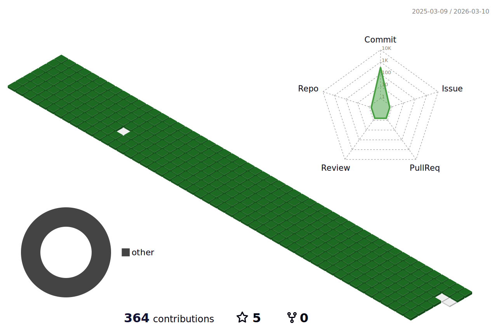

<!--
**jjun0hg/jjun0hg** is a ✨ _special_ ✨ repository because its `README.md` (this file) appears on your GitHub profile.

Here are some ideas to get you started:

- 🔭 I’m currently working on ...
- 🌱 I’m currently learning ...
- 👯 I’m looking to collaborate on ...
- 🤔 I’m looking for help with ...
- 💬 Ask me about ...
- 📫 How to reach me: ...
- 😄 Pronouns: ...
- ⚡ Fun fact: ...
-->

<!--font: https://fonts.google.com/specimen/Redressed   Redressed,Festive --> 

 
 
 

<!--

-->

 

<!--    -->
<!-- https://github.com/Ashutosh00710/github-readme-activity-graph -->
 
 
<!--

-->
    
#### :pencil2: Study log
   

