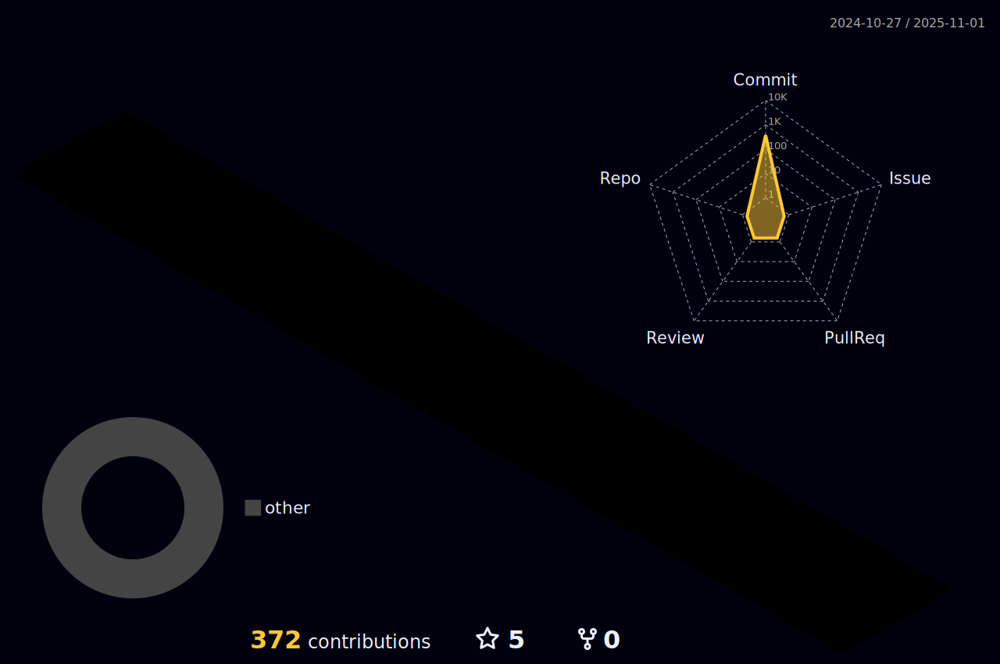

<!--
**jjun0hg/jjun0hg** is a ✨ _special_ ✨ repository because its `README.md` (this file) appears on your GitHub profile.

Here are some ideas to get you started:

- 🔭 I’m currently working on ...
- 🌱 I’m currently learning ...
- 👯 I’m looking to collaborate on ...
- 🤔 I’m looking for help with ...
- 💬 Ask me about ...
- 📫 How to reach me: ...
- 😄 Pronouns: ...
- ⚡ Fun fact: ...
-->

<!--font: https://fonts.google.com/specimen/Redressed   Redressed,Festive --> 
 
 
<a href="s">

 
  

 </a>
 
 

 

 
 
 

   
  
🚀 Stack
   

 
 <!-- 이미지 사진 사이트
https://icon-icons.com/icon/visual-studio-code-logo/144754
-->
  
🌠Languages  
  
<code> python</code>
<code> java</code>
 <code> R</code>
 <code> Javascript</code>
 <code> html5</code>
 <code> shellScript</code>
 
  
  
 🌠I've experienced  
  
 <code> eclipse</code>
  <code> vsCode</code>
  <code> SQL</code>
  <code> OracleDB</code>
  <code> Linux</code>
  <code> Spring</code>
   <code> Git</code>
   <code> Github</code>
    <code> Apache_Tomcat</code>
    <code> Jeus </code>
 

 
 
 
#### :pencil2: Study log

 
